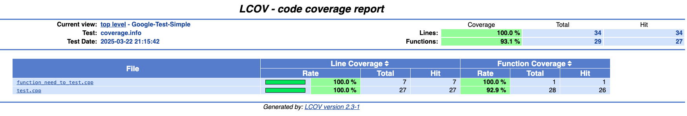

# Google Test Simple

## 1. Intall lastest google test with command lines:
```
git clone https://github.com/google/googletest
cd googletest
mkdir build
cd build
cmake ..
make
make install
```

## 2. Build and run this project with CMake

```sh
cd Google-Test-Simple
rm -rf build
mkdir build && cd build
cmake .. && make
./runTests
```

## 3. Build and run this project with Makefile

```sh
# Clean any previous builds
make clean

# Build the project, run tests, and generate coverage report
make all

# Or you can run individual steps:
make            # Just build the project
make run_tests  # Run the tests
make coverage   # Generate coverage report
make display    # Show coverage statistics

# To show html report
open .output/coverage_report/index.html  # On macOS
xdg-open .output/coverage_report/index.html  # On Linux
```

### Coverage Result

**Console:**

```sh
Overall coverage rate:
  source files: 2
  lines.......: 100.0% (34 of 34 lines)
  functions...: 93.1% (27 of 29 functions)
Message summary:
  1 warning message:
    category: 1
lcov --ignore-errors inconsistent,unsupported,format,unused --list .output/coverage.info
                             |Lines       |Functions  
Filename                     |Rate     Num|Rate    Num
======================================================
function_need_to_test.cpp    | 100%      7| 100%     1
test.cpp                     | 100%     27|92.9%    28
======================================================
                       Total:| 100%     34|93.1%    29
```

**HTML report**




The coverage report will be generated in `.output/coverage_report/index.html`. Open this file in a web browser to view the detailed coverage report.

### Prerequisites for Makefile build:
- g++ compiler
- Google Test library
- lcov (for coverage reporting)

To install prerequisites on macOS:
```sh
brew install lcov
```


